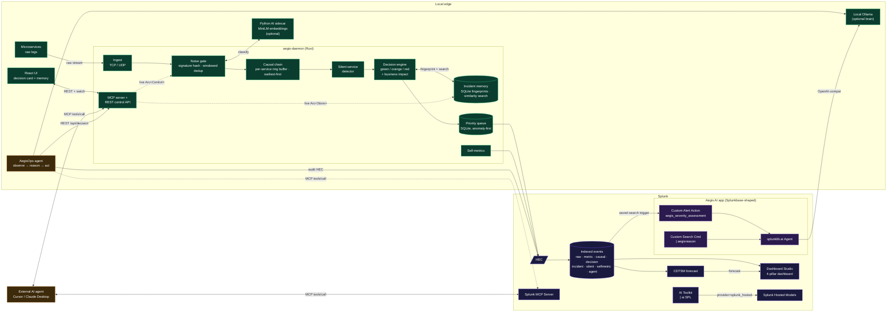

# Aegis — Architecture

Aegis is one Rust daemon and three optional companions (a Python AI
sidecar, a React control panel, an autonomous Python agent). Every
in-process pillar runs inside the same `aegis-daemon` process and shares
a single `Arc<Control>` + `Arc<Queue>` + `Arc<IncidentStore>` — there is
no internal IPC, no second database, no separate service mesh.



## The four pillars

| # | Pillar             | Where it lives                                                                 |
|---|--------------------|---------------------------------------------------------------------------------|
| 1 | **Noise gate**     | `gateway/aegis-core/src/{signature,dedup,summary}.rs`                            |
| 2 | **Causal chain**   | `gateway/aegis-core/src/{service,causal}.rs`                                     |
| 3 | **Incident memory**| `gateway/aegis-core/src/incident_memory.rs` (SQLite, local, free)                |
| 4 | **Decision card**  | `gateway/aegis-core/src/{decision,service_catalog}.rs`                            |

Plus a silent-service detector in `gateway/aegis-core/src/silence.rs` and
a control-plane surface in `gateway/aegis-mcp/`.

### Pillar 1 — Noise gate

Hashes the **structural signature** of each line (numbers, UUIDs, IPs,
timestamps masked) and collapses repeats inside a sliding window into a
single `{signature, count, window, sample, service}` metric event.
The first occurrence of every signature is always forwarded raw so the
operator never loses incident context. Handles edge cases the README
calls out: bursts of 3 lines or 30,000 lines both collapse cleanly.

**Why this matters:** ~99.96% ingest reduction on a single crash-looping
service. Worked example with verifiable arithmetic in
[`docs/finops-math.md`](docs/finops-math.md).

### Pillar 2 — Causal chain

Each `FirstOccurrence` event is tagged with the *service* that produced
it (via `service::extract_full`, with config hints and continuation-line
inheritance). A ring buffer per service tracks recent first-fires. When
≥ `min_services` distinct services first-fire inside `window_secs`, the
engine emits a `CausalChain` event whose `chain` field lists them in
temporal order. **The earliest service is the probable root cause.**

The chain comes with a confidence score: clear temporal separation gives
high confidence; everything firing in the same instant gives lower
confidence (the order is ambiguous). A cooldown suppresses re-emission so
a long incident produces one chain, not one per dedup window.

See [`docs/causal-chain.md`](docs/causal-chain.md).

### Pillar 3 — Incident memory

Every chain is fingerprinted — service set, signature set, ordered chain,
root cause — and written to a small SQLite database. On the next chain,
Aegis ranks all stored fingerprints by a fast, deterministic similarity
score (Jaccard on signatures + Jaccard on services + LCS on chain order +
root-cause bonus). The top matches are attached to the new decision card
along with any cause + fix text the engineer recorded last time.

Search is sub-millisecond at ~10,000 incidents because everything is
local indexed scans on small JSON blobs — no embedding model required.

See [`docs/memory.md`](docs/memory.md).

### Pillar 4 — Decision card

The card is the human-facing output of pillars 2 and 3. It carries:

* a **health state** (green / orange / red) — surfaced as `state` on
  every self-metric so the dashboard badge colours itself,
* the **root cause** and a one-sentence headline grounded in the chain,
* the **business impact** of the affected service, from a small TOML
  catalogue,
* the **suggested next step**, preferring a *resolved* similar past
  incident's recorded fix when one exists,
* up to N **similar past incidents** with each one's cause + fix (when
  resolved).

Engineers see this on the UI, on the dashboard, and in MCP. The card
**never reaches into production** — that's deliberate. The three
buttons are `I'm on it`, `Show me more`, `This looks different`.
Clicking `I'm on it` is the only side effect: it logs the engineer
took ownership.

See [`docs/decision-card.md`](docs/decision-card.md).

## Three planes, one process

| Plane    | What it does                                                                  | Implementation                       |
|----------|--------------------------------------------------------------------------------|---------------------------------------|
| Data     | Ingest → dedup → causal → silence → decision → queue → HEC                    | `aegis-core` (Rust, tokio, rusqlite)  |
| AI       | Classify each new signature once, attach verdict to the eventual metric       | `sidecar/` (FastAPI, sentence-transformers, optional) |
| Control  | Same `Arc<…>` exposed via (a) MCP for AI agents, (b) REST for the UI         | `aegis-mcp` (Rust, axum, rmcp)        |

All planes share one Tokio runtime. Cloning a `Control` or a `Queue` is
free (an `Arc` bump); the MCP server's `latest_decision` tool reads the
same in-memory snapshot the React UI polls on `/api/status.decision`.

## Splunk integration touchpoints

| Capability               | How Aegis uses it                                                                                                            | Targeted prize                 |
|--------------------------|------------------------------------------------------------------------------------------------------------------------------|---------------------------------|
| **HEC**                  | Primary egress. Seven sourcetypes (`raw`, `metric`, `summary`, `causal`, `decision`, `incident`, `silent`) plus `selfmetric` | Best of Observability           |
| **MCP Server v1.1+**     | Aegis is on both sides: own MCP server (8 tools) + AegisOps Agent is a real MCP client of `splunk_run_query`                | Best Use of Splunk MCP Server   |
| **AI Toolkit `\| ai`**   | Three live LLM transports (`ollama`, `aitk_ollama`, `splunk_ai`); one config flag switches between them                     | Best Use of Splunk Hosted Models |
| **Hosted Models**        | Default Ollama model name (`gpt-oss:20b`) matches the Hosted Models identifier; flips to true Hosted Models with one env var | Best Use of Splunk Hosted Models |
| **CDTSM**                | Dashboard forecast panels + agent feedback loop                                                                              | Best Use of Splunk Hosted Models |
| **`splunklib.ai`**       | Custom Alert Action + Custom Search Command, AppInspect clean                                                                | Best Use of Splunk Developer Tools |
| **Dashboard Studio**     | Single dashboard rendering all four pillars + FinOps + CDTSM                                                                 | Best of Observability           |

## Data flows

* **Ingest** — TCP and UDP listeners feed an `mpsc<IngestLine>`.
* **Dedup** — A single async task owns the open-signature `HashMap`.
  First occurrence emits a raw event immediately; subsequent occurrences
  bump a counter; window-close emits one collapsed metric. Per-source
  continuation-line tracking attributes stack-trace frames to the parent
  service.
* **Causal** — Records every `FirstOccurrence` in a per-service ring
  buffer. Each event triggers a `try_detect` pass that emits a chain
  when ≥ `min_services` are seen inside the window.
* **Memory** — Each chain is written through to SQLite as an open
  fingerprint. `Store::search_similar` ranks past fingerprints by the
  weighted similarity formula above; the top-N matches ride along on
  the new decision card.
* **Decision** — Synthesises a green / orange / red card from the chain
  + similarity matches + service catalogue. Idle ticks downshift the
  card back to green after `idle_to_green_secs`.
* **Silence** — Watches per-service `last_seen` timestamps; emits a
  `ServiceSilent` event when a previously-chatty service has been quiet
  for `silence_secs`.
* **Queue** — Every emitted event is enqueued in SQLite with a priority
  (`HIGH` for raws/causal/decision/silent, `MEDIUM` for metrics, `LOW`
  for summaries). The drain task pulls priority-ordered batches, posts to
  HEC, marks the gateway offline on failure, and backs off exponentially.
* **Self-metrics** — Snapshots `Control` every 15s (`state`,
  `dedup_savings_pct`, `incidents_remembered`, queue depth, …) and
  emits a dedicated `aegis:selfmetric` event so the dashboard can show
  the gateway's own performance in real time.

## Control flows

* **Browser UI** → polls `/api/status` every 2 s, `/api/incidents` every
  5 s. `/api/decision/ack` records "I'm on it". `/api/incidents/{id}/resolve`
  attaches the resolution card.
* **MCP client** (Cursor, Claude Desktop) → `POST /mcp` with JSON-RPC
  2.0. Eight tools — including `latest_decision`, `recent_incidents`,
  `resolve_incident`, `acknowledge`.
* **AegisOps Agent** → reads the gateway's decision card directly,
  forwards it to the LLM as a `INCIDENT CARD` block, observes Splunk
  through the official Splunk MCP Server (or REST fallback), actuates
  only low-risk tools by default, audits every decision to HEC under
  `sourcetype=aegis:agent`.

All three planes mutate the **same `Arc<Control>`** the data plane reads
on its hot path. When an external AI agent calls `aegis.override(seconds=30)`
via MCP, the very next iteration of the dedup loop reads
`control.override_active() == true` and switches to raw passthrough — a
real agentic loop, not a fake.

## File map

```text
.
├── README.md                  Quick start: demo + Path B + Path C
├── ARCHITECTURE.md            This file
├── Troubleshooting.md         Symptom → fix reference
├── LICENSE                    MIT
├── Cargo.toml                 Rust workspace manifest
├── rust-toolchain.toml        Pinned stable Rust
├── gateway/                   Rust workspace
│   ├── aegis-core/            ingest, signature, dedup, causal, memory, decision, queue, HEC
│   ├── aegis-mcp/             MCP HTTP server + REST control API
│   └── aegis-daemon/          binary that wires it all together
├── sidecar/                   Python AI sidecar (optional)
├── agent/                     AegisOps autonomous agent
├── apps/aegis_ai/             Splunkbase-shaped Splunk app
├── ui/                        React control panel
├── dashboards/                Splunk Dashboard Studio JSON
├── configs/                   TOML configs (demo + live + multi-edge)
├── demo/                      log_spammer.py + canned smoke fixtures
└── docs/                      Deep-dive docs
```
