# Aegis — Architecture

> Top-level architecture diagram for judges and reviewers, satisfying the
> Splunk Agentic Ops Hackathon submission requirement that this file live
> at the root of the repository. See [`docs/architecture.md`](docs/architecture.md)
> for the detailed walkthrough.

Aegis is a **Splunk-native, MCP-bidirectional observability gateway**
that sits between applications and Splunk. It deduplicates repetitive
error loops into lightweight metrics, summarizes routine traffic,
buffers everything offline with anomaly-first priority, forecasts its
own saturation with the **Cisco Deep Time Series Model**, ships a
`splunk-appinspect`-clean **Splunk app** that grades each alert
through `splunklib.ai.Agent`, and is controllable end-to-end over
MCP — both *by* external AI agents and *from* an autonomous AegisOps
agent that itself uses `splunk_run_query` over JSON-RPC.

```mermaid
flowchart LR
    subgraph Edge["Local Edge Environment"]
        APP["Microservices<br/>raw logs &amp; metrics"]
        subgraph Aegis["Aegis Gateway (Rust)"]
            ING["Ingest<br/>TCP &middot; UDP"]
            CORE["Processing Core<br/>signature hash &middot; dedup<br/>&middot; cache &middot; counters"]
            QUEUE[("Priority Queue<br/>SQLite, anomaly-first")]
            SINK["HEC Sink<br/>batched, retry,<br/>backoff"]
            SELFM["Self-metrics<br/>emitter"]
            MCPSRV["MCP HTTP Server<br/>+ REST control API<br/>(aegis-mcp v0.1)"]
        end
        SIDECAR["Python AI Sidecar<br/>MiniLM embeddings<br/>KMeans clustering<br/>hybrid classifier"]
        UI["Control Panel UI<br/>React + Vite"]
        OLLAMA["Local Ollama<br/>gpt-oss:20b<br/>(matches Splunk Hosted<br/>Models name)"]
    end

    subgraph Splunk["Central Splunk Environment"]
        HEC[/"HTTP Event Collector"/]
        INDEX[("Indexed Events<br/>aegis:raw &middot; aegis:metric<br/>aegis:selfmetric &middot; aegis:agent<br/>aegis_ai:assessment")]
        DASH["Dashboard Studio<br/>11 panels incl. CDTSM<br/>queue + savings forecast"]
        CDTSM["Cisco Deep Time<br/>Series Model<br/>(Splunk Hosted)<br/>&#124; apply CDTSM"]
        SMCP["Splunk MCP Server<br/>splunk_run_query<br/>+ knowledge objects"]
        AITK["Splunk AI Toolkit<br/>Connection Mgmt<br/>&#124; ai SPL command"]
        SAIA["AI Assistant 2.0"]
        HOSTED["Splunk Hosted Models<br/>gpt-oss-20b &middot;<br/>Foundation-Sec"]
        subgraph SplunkApp["Aegis AI Splunk App (apps/aegis_ai/)"]
            ALERT["Custom Alert Action<br/>aegis_severity_assessment"]
            CSC["Custom Search Cmd<br/>&#124; aegisreason"]
            SDKAGENT["splunklib.ai.Agent<br/>+ OpenAIModel"]
        end
    end

    AGENT["External AI Agent<br/>Cursor / Claude Desktop"]
    OPS["AegisOps Agent<br/>observe &rarr; reason &rarr; act<br/>(+ CDTSM-aware hint)"]

    APP -->|raw stream| ING
    ING --> CORE
    CORE <-->|classify per signature| SIDECAR
    CORE -->|enqueue| QUEUE
    QUEUE -->|priority drain| SINK
    SINK -->|metrics + raw + summaries| HEC
    SELFM -->|self perf telemetry| HEC
    HEC --> INDEX
    INDEX --> DASH
    INDEX --> CDTSM
    CDTSM -->|forecast time series| DASH

    UI <-->|/api/status<br/>/api/command| MCPSRV
    AGENT <-->|MCP tools/call| SMCP
    AGENT <-->|MCP tools/call| MCPSRV

    OPS -->|REST /api/*| MCPSRV
    OPS -->|reason: default| OLLAMA
    OPS -->|reason: aitk_ollama| AITK
    OPS -.->|reason: splunk_ai<br/>when SLIM provisioned| AITK
    OPS -->|observational SPL via<br/>MCP tools/call &uarr; REST oneshot| SMCP
    OPS -->|read forecast| CDTSM
    OPS -->|audit HEC| HEC

    AITK -->|provider=ollama_local| OLLAMA
    AITK -.->|provider=splunk_hosted| HOSTED

    INDEX -->|saved-search trigger| ALERT
    ALERT --> SDKAGENT
    CSC --> SDKAGENT
    SDKAGENT -->|OpenAI HTTP| OLLAMA
    ALERT -->|index assessment| HEC
    CSC -->|enrich pipeline rows| INDEX

    MCPSRV -.->|live Arc&lt;Control&gt;| CORE
    MCPSRV -.->|reset / clear| QUEUE
    SMCP --> INDEX
    SAIA <--> HOSTED
    SIDECAR -.->|&#124; ai classify<br/>via AITK| AITK

    classDef edge fill:#0b3d2e,stroke:#3ddc97,color:#fff
    classDef splunk fill:#1a1a3e,stroke:#7c5cff,color:#fff
    classDef splunkapp fill:#2a1a4e,stroke:#b58cff,color:#fff
    classDef agent fill:#3d2a0b,stroke:#ffb86b,color:#fff
    class APP,ING,CORE,QUEUE,SINK,SELFM,MCPSRV,SIDECAR,UI,OLLAMA edge
    class HEC,INDEX,DASH,SMCP,SAIA,HOSTED,AITK,CDTSM splunk
    class ALERT,CSC,SDKAGENT splunkapp
    class AGENT,OPS agent
```



## Three planes, one process

| Plane | What it does | Implementation |
|-------|--------------|----------------|
| **Data** | Receives raw logs, hashes signatures, collapses duplicates, summarizes routine traffic, buffers offline, drains to HEC anomaly-first | `aegis-core` (Rust) — async tokio pipeline with mpsc channels and SQLite-backed priority queue |
| **AI** | Classifies each new signature once and attaches the verdict to the eventual collapsed metric event | `sidecar/` (Python FastAPI) — `sentence-transformers/all-MiniLM-L6-v2` + sklearn KMeans + Splunk `| ai` hosted-model adapter (OpenAI-compat fallback) |
| **Control** | Exposes the same `Arc<Control>` and `Queue` handles to (a) MCP clients over streamable-HTTP, (b) a browser UI over REST, and (c) the AegisOps autonomous agent | `aegis-mcp` (Rust) + `agent/` (Python) |

All three planes run in a **single daemon process** sharing the same Arc-backed
state. When an external AI agent calls `aegis.override(seconds=30)` via MCP,
the very next iteration of the dedup loop reads `control.override_active() == true`
and switches to raw passthrough — a real agentic loop, not a fake.

## Splunk integration touchpoints

| Splunk capability | How Aegis uses it | Targeted prize |
|-------------------|-------------------|----------------|
| **HTTP Event Collector (HEC)** | Primary egress path. Five sourcetypes: `aegis:raw`, `aegis:metric`, `aegis:selfmetric`, `aegis:agent`, `aegis_ai:assessment` | Best of Observability |
| **MCP Server (Splunkbase, v1.1.3)** | Aegis is on **both sides** of MCP: it hosts its own MCP server (`aegis-mcp v0.1`, 5 edge-control tools); AegisOps Agent is a real MCP client of `splunk_run_query` via JSON-RPC 2.0, auto-detecting the search tool name. See [`docs/mcp.md`](docs/mcp.md). | Best Use of Splunk MCP Server |
| **AI Toolkit (AITK) `\| ai` SPL** | Three live LLM transports through AITK Connection Management: `aitk_ollama` (LIVE today via user-defined Ollama provider), `splunk_ai` (one-line switch when SLIM lands), `ollama` (raw HTTP, edge-first default). See [`docs/aitk-ollama.md`](docs/aitk-ollama.md) and [`docs/splunk-blocker.md`](docs/splunk-blocker.md). | Best Use of Splunk Hosted Models |
| **Hosted Models** (`gpt-oss-20b`, `Foundation-Sec-1.1-8B`) | Default Ollama runs `gpt-oss:20b` (matches the Hosted Models identifier). The same SPL `\| ai` plumbing already targets the SLIM-backed `provider=splunk_hosted` shape — one config line to migrate when a SLIM-provisioned account is available. | Best Use of Splunk Hosted Models |
| **Cisco Deep Time Series Model (CDTSM)** | Two dashboard forecast panels (`\| apply CDTSM queue_depth …` / `\| apply CDTSM dedup_savings_pct …`); AegisOps reads the same forecast and surfaces a "predictive signal" hint to the LLM when a threshold breach is projected. See [`docs/cdtsm-forecast.md`](docs/cdtsm-forecast.md). | Best Use of Splunk Hosted Models |
| **`splunklib.ai` SDK** | `apps/aegis_ai/` ships a Custom Alert Action and `\| aegisreason` Custom Search Command, both built on `splunklib.ai.OpenAIModel` + `Agent` with Pydantic output schemas. `splunk-appinspect`: **0 failures, 0 future_failures** (see `apps/aegis_ai/appinspect-report.json`). | Best Use of Splunk Developer Tools |
| **AI Assistant 2.0** | No programmatic API today. Documented pairing: operator asks SAIA to explain `sourcetype=aegis:agent` audit events the autonomous agent produced. See [`docs/saia-integration.md`](docs/saia-integration.md). | Best of Observability |
| **Dashboard Studio** | [`dashboards/aegis.json`](dashboards/aegis.json) ships **11 panels** including dedup savings, top suppressed signatures, classifier verdict, classifier-strategy breakdown, first-occurrence rate, and the two new CDTSM forecast lines | Best of Observability |

## Data flows

* **Raw ingest** — TCP/UDP listeners feed an `mpsc<IngestLine>`.
* **Dedup** — A single async task owns the open-signature `HashMap`. First
  occurrence of any signature emits a raw event immediately; subsequent
  occurrences within the window bump a counter. On window close the
  counter becomes one collapsed metric event.
* **AI enrichment** — Per *new* signature (not per line — important for
  perf), the dedup task spawns a background task that calls the sidecar's
  `/classify`. The result lands in a classification cache keyed by
  signature and is attached to the eventual collapsed event.
* **Queue** — Every emitted event is enqueued in SQLite with a priority
  (`HIGH` for first-occurrences and override-mode raws, `MEDIUM` for
  collapsed metrics). A separate drain task pulls priority-ordered
  batches, POSTs to HEC, and marks the gateway offline on failure.
* **Self-metrics** — A timer snapshots `Control` every 15 s and emits a
  dedicated `aegis:selfmetric` event so the dashboard can show the
  gateway's own performance in real time.

## Control flows

* **Browser UI** → `GET /api/status` every 2 s, `POST /api/command` on user
  action.
* **MCP client (Cursor, Claude Desktop)** → `POST /mcp` with JSON-RPC 2.0
  over streamable HTTP. Five tools: `status`, `reset`, `diagnostic`,
  `override`, `replay_raw`.
* **AegisOps Agent** → polls each gateway's REST API, runs observational
  SPL against Splunk **either** through the official Splunk MCP Server
  (`splunk_run_query` via JSON-RPC `tools/call`, auto-detected) **or**
  through raw REST `oneshot` (graceful fallback), reads the CDTSM
  forecast and adds a "predictive signal" hint to the LLM prompt when a
  threshold breach is projected, calls its configured **LLM transport**
  (`ollama` default, `aitk_ollama`, or `splunk_ai`), actuates via
  `POST /api/command`, audits to `sourcetype=aegis:agent` (optional).
* Both control planes mutate the **same `Arc<Control>`** the data plane
  reads on its hot path — verified end-to-end during development (the
  README walks through the smoke test).

## File map

```
.
|-- ARCHITECTURE.md         this file (Devpost-required root architecture)
|-- README.md               quick-start with two setup paths (demo & live)
|-- LICENSE                 MIT
|-- Cargo.toml              Rust workspace manifest
|-- Cargo.lock              Reproducible Rust dependency lock
|-- rust-toolchain.toml     Pinned Rust toolchain (stable)
|-- gateway/                Rust workspace (data plane + control plane)
|   |-- aegis-core/         ingest, dedup, queue, HEC client, sidecar client
|   |-- aegis-mcp/          MCP HTTP server + REST control API
|   `-- aegis-daemon/       binary that wires core + mcp together
|-- sidecar/                Python AI sidecar (FastAPI)
|   |-- pyproject.toml      Python dependencies and entry point
|   `-- aegis_sidecar/      embeddings, clustering, classifier, splunk_ai adapter
|-- agent/                  AegisOps autonomous agent (observe → reason → act)
|   |-- pyproject.toml      Agent dependencies and CLI entry point
|   `-- aegis_ops/          observer (+ CDTSM forecasts), reasoner, transports (Ollama / AITK+Ollama / Splunk |ai),
|                           splunk_mcp_client.py (JSON-RPC 2.0), policy, actuator, auditor
|-- apps/
|   `-- aegis_ai/           Splunk app (Custom Alert Action + | aegisreason CSC, splunk-appinspect clean)
|-- ui/                     React 19 + Vite 7 + Tailwind v4 control panel
|   |-- package.json        Node dependencies + scripts
|   `-- src/                components + REST client
|-- dashboards/             Splunk Dashboard Studio JSON + install guide
|-- demo/                   log_spammer.py traffic generator + canned MCP/REST fixtures
|-- configs/
|   |-- aegis.example.toml  Production template (copy to aegis.toml, fill in HEC token)
|   |-- aegis.demo.toml     No-Splunk demo config (3s dedup window, stderr sink)
|   |-- aegis.us-east.*     Multi-edge templates (demo + live)
|   `-- aegis.eu-west.*
`-- docs/                   architecture deep-dive, MCP integration, FinOps math, SAIA notes
```
