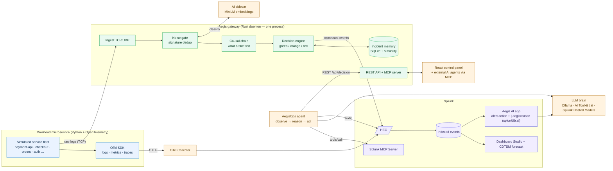

# Aegis — Architecture Diagram

Aegis sits between your services and Splunk. A self-driving **workload**
microservice produces telemetry; the **Aegis gateway** (one Rust daemon)
quiets the noise, finds what broke first, and remembers every fix; **AI**
turns that into a decision an on-call engineer can act on; and **Splunk** is
the system of record and the surface everything lands on.



## 1. How the application interacts with Splunk

* **Processed events → HEC.** The gateway dedupes, correlates, and decides,
  then ships compact events to Splunk's **HTTP Event Collector** across eight
  sourcetypes (`aegis:raw`, `metric`, `summary`, `causal`, `decision`,
  `incident`, `silent`, `selfmetric`). Net effect: up to ~99.96% less ingest
  on a crash-looping service.
* **OpenTelemetry → Collector → Splunk.** The workload exports logs, metrics,
  and traces over **OTLP** to an OpenTelemetry Collector, which forwards them
  to Splunk via the `splunk_hec` exporter.
* **Dashboard Studio** reads the indexed events for a panel-per-pillar view;
  **CDTSM** adds forecast panels.
* **MCP, both directions.** Aegis runs its own **MCP server** (8 tools); the
  AegisOps agent is an **MCP client** of the official **Splunk MCP Server**,
  so every observational SPL call is auditable.

## 2. How AI models / agents are integrated

* **AI sidecar** (FastAPI + sentence-transformers) classifies each new log
  signature once with MiniLM embeddings; the gateway attaches the verdict.
* **AegisOps agent** runs `observe → reason → act`: it reads the gateway's
  decision card, grounds an LLM prompt in it, and may call low-risk Aegis
  tools — auditing every decision to Splunk.
* **One LLM flag, three transports:** local **Ollama**, Splunk **AI Toolkit
  `| ai`**, or **Splunk Hosted Models**.
* **Aegis AI app** (Splunkbase-shaped) adds a Custom Alert Action and the
  `| aegisreason` SPL command, both powered by `splunklib.ai.Agent`.

## 3. Data flow between services, APIs, and components

```text
workload ──raw logs (TCP 5140)──▶ Aegis gateway ──processed (HEC)──▶ Splunk
   │                                   │  ▲                            │
   └── OTLP ▶ OTel Collector ▶ HEC ────┘  │ REST + MCP (7321)          ▼
                                          ├──▶ React control panel   Dashboards
                                          ├──▶ external AI agents (MCP)
                                          └──▶ AegisOps agent ──▶ LLM ──▶ HEC audit
```

The control plane shares one in-memory `Arc<Control>`: the UI's REST poll, the
MCP `latest_decision` tool, and the agent all read the exact same live state
the data plane writes on its hot path.

---

The full deep dive — per-stage state machines, memory/perf envelope, and the
file map — lives in [`docs/architecture.md`](docs/architecture.md).
