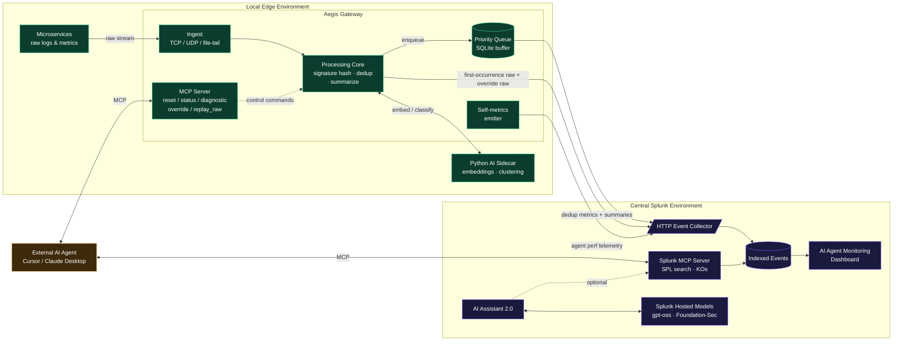

# Aegis Technical Architecture

The system is split into two environments — the **Local Edge Environment**
where applications run and where Aegis lives, and the **Central Splunk
Environment** where ingestion, indexing, and the AI Assistant reside.

## Data flow

1. **Raw telemetry** flows from microservices to Aegis's ingest layer over
   TCP / UDP / file-tail. The ingest layer normalizes records to a common
   internal shape and tags each with an arrival timestamp.
2. The **Processing Core** computes a *structural signature* for every log
   line — a hash of the line with numbers, UUIDs, timestamps, and other
   high-cardinality tokens masked out. Identical signatures arriving within a
   configurable window are collapsed into a single metric event of the form
   `{signature, count, window, first_seen, last_seen, sample}`.
3. The first occurrence of any signature is always sent raw (so an operator
   has full context for the incident); subsequent occurrences within the
   window become a single metric.
4. **Routine traffic** (HTTP 2xx, INFO-level structured logs) is batched and
   summarized into compact JSON: `{status: "routine", requests, p50_ms,
   p95_ms, p99_ms, anomalies}`.
5. The **Python AI Sidecar** is called out-of-band to embed log lines and
   cluster them at higher semantic resolution than the structural hash —
   catching templated messages that vary too much for hash-based dedup.
6. The **SQLite-backed priority queue** buffers everything locally. On
   reconnect after an outage, it drains *anomalies first*, then summaries,
   then routine batches.
7. **HEC** receives everything: deduplicated metrics, summaries, first-seen
   raw lines, and override-mode raw streams.
8. The **AI Agent Monitoring dashboard** consumes Aegis's own self-metrics
   (latency, dedup ratio, queue depth, signature count, sidecar token use)
   from a dedicated HEC source.

## Control flow (agentic)

The Aegis daemon exposes an MCP server. Any MCP-aware agent (Cursor, Claude
Desktop, or a custom orchestrator built on Splunk's MCP Server) can:

* call `status` to inspect the live queue and dedup state,
* call `override` during an incident to disable compression and stream raw
  logs for a configurable window,
* call `replay_raw` to ask the gateway to re-emit buffered raw events for a
  specific time range,
* call `diagnostic` to enable deep tracing at the edge,
* call `reset` to clear state during testing.

The intended demo orchestration: a single AI agent connects to *both*
Splunk's MCP Server (to run SPL searches) and Aegis's MCP Server (to control
the edge). The agent reasons across both: "search Splunk for unusual error
counts → if found, call Aegis's `override` tool to get raw logs → search
Splunk again for the now-streamed raw lines."

## Why this wins the special prizes

* **Best Use of Splunk MCP Server.** We don't just consume Splunk's MCP
  Server — we ship a complementary MCP server that lets agents control
  *edge* infrastructure. The demo shows both in the same agent session.
* **Best Use of Splunk Hosted Models.** The sidecar's embedding / clustering
  layer is wired to call Splunk Hosted Models (`gpt-oss-20b` or
  `Foundation-Sec-1.1-8B-Instruct`) for semantic log analysis, keeping data
  inside the Splunk security boundary. A local HuggingFace fallback is used
  if hosted-model access is not provisioned.
* **AI Agent Monitoring.** Aegis emits its own performance and reasoning
  telemetry to Splunk so the dashboard literally shows the AI agent's
  behavior in real time.
