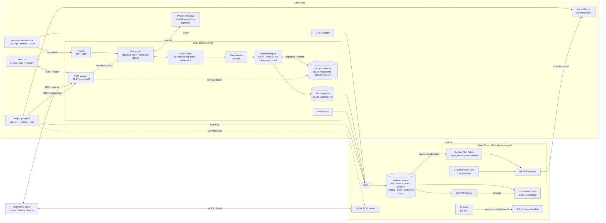

# Aegis  -  technical architecture (deep dive)

The at-a-glance diagram and the three submission-required highlights (Splunk
interaction, AI integration, data flow) live at the root in
[`../architecture_diagram.md`](../architecture_diagram.md). This page is the
deep dive: the full system diagram, per-stage state machines, the data
flows, and the assumptions Aegis makes about its environment.

Aegis is one Rust daemon and four optional companions  -  a self-driving
Python **workload** microservice that produces the telemetry, a Python **AI
sidecar**, a React **control panel**, and an autonomous Python **agent**.
Every in-process pillar runs inside the same `aegis-daemon` process and
shares a single `Arc<Control>` + `Arc<Queue>` + `Arc<IncidentStore>`  -  no
internal IPC, no second database, no service mesh.



## The four pillars

| # | Pillar             | Where it lives                                                                 |
|---|--------------------|---------------------------------------------------------------------------------|
| 1 | **Noise gate**     | `gateway/aegis-core/src/{signature,dedup,summary}.rs`                            |
| 2 | **Causal chain**   | `gateway/aegis-core/src/{service,causal}.rs`                                     |
| 3 | **Incident memory**| `gateway/aegis-core/src/incident_memory.rs` (SQLite, local, free)                |
| 4 | **Decision card**  | `gateway/aegis-core/src/{decision,service_catalog}.rs`                           |

Plus a silent-service detector in `gateway/aegis-core/src/silence.rs` and a
control-plane surface in `gateway/aegis-mcp/`.

## The single-daemon model

`aegis-daemon` is one Rust process. Inside it run six Tokio tasks
glued together by `mpsc` channels:

```text
ingest        → mpsc<IngestLine>     ┐
                                     ├─→ dedup     → mpsc<ProcessedEvent>
                                     │                    ┌─→ causal
                                     │                    │      ↓
                                     │                    ├─→ silence
                                     │                    │      ↓
                                     │                    └─→ decision
                                     │                            ↓
                                     │                          queue
                                     │                            ↓
                                     │                          HEC sink
                                     │
self_metrics  → HEC every 15s ───────┘
mcp_server    → axum service binding /mcp + /api (shares Arc<Control>+Arc<Queue>+Arc<IncidentStore>)
```

Every stage forwards every event downstream unchanged. The extra
stages (causal, silence, decision) additionally emit new events
(`CausalChain`, `ServiceSilent`, `IncidentMemory`, `DecisionCard`)
when their conditions fire.

## The pillars, in detail

### 1. Noise gate (`signature` + `dedup` + `summary`)

* `signature::compute` masks high-cardinality tokens (numbers, UUIDs,
  IPs, RFC3339 timestamps, hex blobs, durations) and `blake3`-hashes
  the result. Two messages that differ only in those tokens hash the
  same.
* `dedup::run` keeps an open-signature `HashMap<Signature, OpenEntry>`.
  First arrival emits `FirstOccurrence` immediately; subsequent
  arrivals inside the window bump `count`. On window close (or eviction
  when `max_open_signatures` is hit), `count > 1` produces a single
  `Collapsed` event; `count == 1` drops silently because the first
  occurrence already covered it.
* `summary::SummaryTable` rolls routine-classified `Collapsed`
  events into per-source `Summary` events when the sidecar is enabled.

### 2. Causal chain (`service` + `causal`)

* `service::extract_full` extracts a service name from each log line.
  Priority: config hint → continuation-line inheritance → JSON field →
  `svc=…` k/v → `LEVEL service:` prefix → bracket prefix → fallback to
  the ingest source string.
* `causal::run` keeps a per-service ring buffer of recent
  `FirstOccurrence` events. On each new event, it computes the earliest
  first-fire per service in the window. When ≥ `min_services` distinct
  services are present, it emits one `CausalChain` event whose `chain`
  is sorted by `ts` (earliest first = root cause).
* A `cooldown_secs` keyed by `root_cause_service` prevents
  re-emission so a long-running incident produces one chain, not one
  per dedup window.

### 3. Incident memory (`incident_memory`)

* `IncidentStore::open` creates (or opens) a SQLite file in WAL mode.
  Schema: one table `incidents` with indexes on `ts` and `chain_id`.
* `record_chain` persists a fresh fingerprint (cause/fix null,
  resolved_at null).
* `search_similar` reads the most recent ~2048 fingerprints into
  memory and scores each one against the new chain using a weighted
  Jaccard + LCS formula. Scoring runs in Rust at native speed  -  the
  whole search is sub-millisecond at typical store sizes.
* `resolve` attaches a `ResolutionCard` (cause + fix) and stamps
  `resolved_at` + `resolved_in_minutes` (delta from chain `ts`).

### 4. Decision card (`decision` + `service_catalog`)

* `DecisionEngine::on_chain` is the synthesiser. Inputs: the new
  `CausalChain`, the result of `Store::search_similar`, and the
  `ServiceCatalog` lookup for the root service. Output: one
  `DecisionCard` event.
* Headline is rendered from the chain  -  "X broke first. Y followed Ns
  later. Root cause: X (NN% confidence)."
* Suggested next step prefers the highest-similarity *resolved* past
  incident over any other match. Falls back to a first-time-nudge
  copy ("please record a resolution card when you fix this") when no
  matches exist.
* Idle ticks downshift the card to green after
  `idle_to_green_secs` of quiet.

### Silent-service detector (`silence`)

* Maintains a `HashMap<service, Heartbeat>` of `(last_seen_unix,
  last_sample, flagged)`.
* On every `FirstOccurrence`, `Collapsed`, and `Raw` event,
  refreshes the heartbeat and clears `flagged`.
* On each sweep (every `sweep_secs`), emits a `ServiceSilent` event
  for any unflagged service whose silence exceeds `silence_secs`.
  Sets `flagged = true` so we don't re-emit until the service talks
  again.

## State surfaced on the control plane

`Control::snapshot()` returns the full `GatewayStatus`:

| Field                  | Source                                     |
|------------------------|---------------------------------------------|
| `uptime_secs`          | wall-clock since process start              |
| `online`               | `set_online` toggle                          |
| `override_active`      | `enable_override(N)` until ts > now         |
| `diagnostic_active`    | same shape                                   |
| `queue_depth`          | `queue::depth()` on HEC sink iterations     |
| `events_in / out`      | atomics bumped in dedup + sink stages       |
| `dedup_savings_pct`    | derived ratio                                |
| `unique_signatures`    | bumped on FirstOccurrence                    |
| `state`                | green / orange / red, set by decision engine |
| `incidents_remembered` | `Store::count()` after each card             |
| `decision`             | full latest `DecisionCard` event             |

The same snapshot powers (a) the React UI's `/api/status` poll every
2 s, (b) the MCP `status` and `latest_decision` tools, (c) the
`aegis:selfmetric` event every 15 s. There's no second source of truth.

## Three planes, one process

| Plane    | What it does                                                                  | Implementation              |
|----------|--------------------------------------------------------------------------------|------------------------------|
| Data     | ingest → dedup → causal → silence → decision → queue → HEC sink              | `aegis-core` (Rust + tokio)  |
| AI       | classify each new signature once, attach to eventual metric                  | `sidecar/` (FastAPI, optional) |
| Control  | shared `Arc` exposed via MCP, REST API, and the React UI                     | `aegis-mcp` (Rust + axum)    |

The shared `Arc`s are the whole trick. The MCP `override` tool, the
React UI's "raw passthrough" toggle, and a hypothetical external
script calling `POST /api/command` all converge on the same atomic
flag the dedup loop reads on its hot path.

## Splunk integration touchpoints

| Capability                  | How Aegis uses it                                                                                                            |
|-----------------------------|------------------------------------------------------------------------------------------------------------------------------|
| **HEC**                     | Primary egress. Seven sourcetypes (`raw`, `metric`, `summary`, `causal`, `decision`, `incident`, `silent`) + `selfmetric`    |
| **MCP Server (Splunkbase)** | Aegis on both sides: own MCP server (8 tools) + AegisOps Agent as a real MCP client of `splunk_run_query` (auto-detected)   |
| **AI Toolkit `\| ai`**      | `SplunkAITransport` implemented for `aitk_ollama` and `splunk_ai`; **not what we ran** on the trial (see [`splunk-blocker.md`](splunk-blocker.md)) |
| **Hosted Models**           | Same model id (`gpt-oss:20b`); SLIM path hibernated until provisioned. **Demo default:** direct Ollama HTTP                |
| **CDTSM**                   | Two dashboard forecast panels; AegisOps reads the same forecast and surfaces it as a `PREDICTIVE SIGNAL` in the LLM prompt |
| **`splunklib.ai`**          | Splunkbase app with Custom Alert Action + `\| aegisreason` Custom Search Command  -  AppInspect clean                          |
| **Dashboard Studio**        | One dashboard with a panel per pillar + the FinOps headlines + CDTSM forecast lines                                          |

## Memory and performance envelope

| Component             | Bound                                                       |
|-----------------------|-------------------------------------------------------------|
| Dedup open table      | `max_open_signatures` (default 4096)  -  bounded by config    |
| Causal ring buffer    | `per_service_buffer` × known services (default 16 × N)      |
| Silence heartbeats    | one entry per known service (~100 B each)                    |
| Decision card slot    | one cached event in `Control` (single `Mutex`)              |
| Incident memory       | full SQLite store; in-memory scan touches at most 2048 rows |
| Self-metrics          | one event every 15 s                                         |

In steady state with 50 services and ~10K events/min ingest, the
daemon's RSS sits well under 100 MB on Windows / Linux / macOS.

## File map

```text
.
├── README.md                  Quick start: Docker + demo + Path B + Path C
├── architecture_diagram.md    At-a-glance diagram (submission requirement)
├── Troubleshooting.md         Symptom → fix reference
├── LICENSE                    MIT
├── Dockerfile                 Single-container build (gateway + UI + workload)
├── docker-compose.yml         One-command run
├── Cargo.toml                 Rust workspace manifest
├── rust-toolchain.toml        Pinned stable Rust
├── gateway/                   Rust workspace
│   ├── aegis-core/            ingest, signature, dedup, causal, memory, decision, queue, HEC
│   ├── aegis-mcp/             MCP HTTP server + REST control API + UI hosting
│   └── aegis-daemon/          binary that wires it all together
├── microservice/             Self-driving telemetry workload (FastAPI + OTel)
├── sidecar/                   Python AI sidecar (optional)
├── agent/                     AegisOps autonomous agent
├── apps/aegis_ai/             Splunkbase-shaped Splunk app
├── ui/                        React control panel
├── dashboards/                Splunk Dashboard Studio JSON
├── configs/                   TOML configs (demo + live + multi-edge + docker)
├── demo/                      log_spammer.py + canned smoke fixtures
└── docs/                      Deep-dive docs (this file, MCP, FinOps, …)
```

The crate boundaries are:

* `aegis-core`  -  pure library. No knowledge of MCP or daemon
  bootstrap. Reused by both the daemon and the MCP crate.
* `aegis-mcp`  -  `rmcp` + `axum` glue. Owns the public HTTP surface
  (REST + MCP) and serves the built control-panel UI.
* `aegis-daemon`  -  thin binary that constructs the shared
  `Control` / `Queue` / `IncidentStore` and runs both pipeline and
  MCP server.
